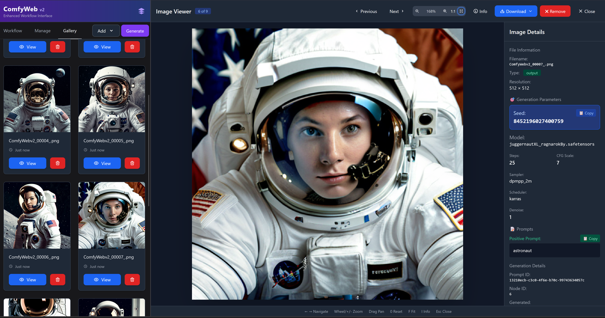

# 🧠 ComfyWeb V2 - Complete User Manual

Welcome to **ComfyWeb V2** – a form-based interface for AI image generation, powered by ComfyUI but designed for intuitive workflow management.


*Card-based workflow interface with sequential execution*

## 🔍 **Image Viewer with Metadata Access**


*Complete metadata access with seed copying, parameter viewing, and zoom controls*

The **Image Viewer** provides comprehensive image inspection tools for analyzing generated results. View complete generation parameters, copy seeds for reproducible results, and inspect images with professional zoom and pan controls.

---

## 🚀 What is ComfyWeb V2?

ComfyWeb V2 is a visual frontend that transforms ComfyUI's node-graph system into a **card-based workflow interface**, where each **card represents a node**, and they **execute sequentially from top to bottom**.

Instead of connecting nodes, you work with organized cards that form a clear workflow.

### 🧩 Templates vs Cards: Understanding the System

**Templates** are complete workflow configurations (like "SDXL Basic" or "Image to Image") that define an entire image generation process.

**Cards** are the individual components within each template - each card represents one processing step in the workflow.

When you select a **template**, ComfyWeb V2 displays it as a **stack of cards** that you can configure:
- Template = The complete workflow configuration
- Cards = Individual processing steps
- You adjust the cards, ComfyWeb V2 executes the workflow

---

## 📚 Template Library

ComfyWeb V2 includes **14 templates** organized across **5 categories**:


*Template organization across 5 categories*

### 📸 **Text to Image** (3 templates)
- **SDXL Basic** - Text-to-image generation using SDXL model
- **SD 1.5 Classic** - Stable Diffusion 1.5 for standard results  
- **Flux GGUF** - Modern model format for advanced generation

### 🖼️ **Image to Image** (3 templates)
- **Basic Image to Image** - Transform existing images with new prompts
- **SDXL Image to Image** - Image transformation using SDXL
- **SD 1.5 Image to Image** - Classic approach for img2img workflows

### 🔍 **Upscaling & Enhancement** (2 templates)
- **Upscale & Enhance** - Improve image quality and resolution
- **Latent Upscaling** - Advanced upscaling using latent space processing

### 📦 **Batch Processing** (1 template)
- **Batch Generation** - Create multiple variations efficiently

### ⚡ **Advanced** (5 templates)
- **SDXL + LoRA** - Style integration with LoRA models
- **Multi-LoRA Style Fusion** - Combine multiple LoRA styles
- **Inpainting** - Selective image editing and object removal
- **ControlNet Pose Control** - Guided generation using pose detection
- **Professional Portrait** - Optimized settings for portrait generation

---

## 🖼️ **Gallery System**

ComfyWeb V2 features a **session-persistent gallery** that automatically collects generated images:

### ✨ **Gallery Features**
- **Automatic Collection** - Generated images appear automatically
- **Session Persistence** - Images remain available across browser refresh
- **Generation Context** - View prompts and settings for each image
- **Grid Interface** - Clean, organized view with hover effects

### 🎯 **How It Works**
1. Generate images using any template
2. Images automatically appear in the Gallery tab
3. Gallery persists until browser tab is closed
4. Compare results and iterate on prompts

---

## 🛠️ **Workflow Management**


*Workflow management interface*

### **Management Features**
- **💾 Save Workflows** - Store custom configurations for reuse
- **📥 Import/Export** - Work with ComfyUI JSON files
- **🔄 Workflow Organization** - Manage saved workflows
- **🧹 Workspace Control** - Clear workspace to start fresh
- **⚙️ Settings** - Configure ComfyUI server connection

Think of **"My Workflows"** as your personal collection of configurations:
- 💾 **Save Custom Workflows** - Store parameter combinations
- ⚡ **Quick Access** - Load saved configurations instantly
- 🔄 **Iteration** - Build on previous work
- 📤 **Import Support** - Drag-and-drop ComfyUI JSON files
- 🎯 **Missing Node Detection** - Guidance for required extensions

---

## 🧱 Workflow Components: Card Overview

Each **card** represents one processing node in ComfyUI. Here are the essential components:

### 🧩 Essential Cards

#### 1. `CheckpointLoaderSimple`
- **Loads the base model** (SDXL, SD 1.5, etc.)
- **Required for generation**
- **Field:** `ckpt_name` - Your model file

#### 2. `EmptyLatentImage`
- Sets resolution and canvas size
- Used for workflows without input images
- **Fields:** `width`, `height`, `batch_size`

#### 3. `CLIPTextEncode` (Prompt Cards)
- Text input for generation guidance
- **Fields:** 
  - **Positive Prompt** - Desired content description
  - **Negative Prompt** - Content to avoid

#### 4. `KSampler`
- Generation engine with control parameters
- **Fields:**
  - `seed` - 0 for random, specific number for reproducible results
  - `steps` - Iteration count (20-30 typical)
  - `cfg` - Prompt adherence (7-12 typical range)
  - `sampler_name` - Algorithm selection

#### 5. `VAEDecode`
- Converts latent image to viewable pixels
- Essential processing step

#### 6. `SaveImage`
- **Critical final card** - saves image to ComfyUI's output
- Images saved with `ComfyWebv2_` prefix

---

## 🔧 Additional Components

### 🧠 `ControlNetLoader` & `ControlNetApply`
- Load ControlNet models for guided generation
- Provides control over composition and structure

### 🎨 `LoraLoader`
- Apply LoRA fine-tuning weights
- Can be combined for creative effects

### 🖼️ `LoadImage`
- **Image Upload Interface** - Load images for img2img workflows
- Features **drag-and-drop upload** with **visual previews**

### ✂️ `MaskComposite` & Inpainting Components
- Combine masks for selective editing
- Used in inpainting workflows

### 🔍 `ImageScaleBy` & Upscaling
- Resize and enhance generated images
- Used in upscaling workflows

---

## ⚡ **Generation Monitoring**


*Real-time generation tracking*

ComfyWeb v2 provides comprehensive generation monitoring:

### **Monitoring Features:**
- **📊 Progress Tracking** - View completion percentage and current processing node
- **⏹️ Stop Control** - Interrupt generation with dedicated stop button
- **📡 Status Updates** - Real-time feedback throughout the process
- **🎯 Node Tracking** - See which processing step is currently running
- **💾 Session Recovery** - Work continues after browser refresh

## 🚀 **Getting Started**

### **Step 1: Select Template**
1. Browse template categories in the sidebar
2. Start with **"SDXL Basic"** for initial generation
3. Review difficulty level and time estimates

### **Step 2: Configure Parameters**
1. **Model Selection** - Choose your checkpoint
2. **Prompt Input** - Describe desired content
3. **Generation Settings** - Adjust steps, CFG, and parameters
4. **Output Settings** - Set resolution and batch size

### **Step 3: Generate and Monitor**
1. Click **"Generate"** to start
2. Monitor real-time progress
3. Images appear in the **Gallery** tab

### **Step 4: Save and Iterate**  
1. **Save successful configurations** to "My Workflows"
2. **Adjust parameters** for variations
3. **Build your workflow collection**

---

## 📸 **Image Upload System**

For **Image-to-Image workflows**, ComfyWeb V2 provides image handling features:

### ✨ **Upload Features**
- **Drag & Drop Interface** - Drag images onto upload areas
- **Visual Previews** - See images immediately after upload
- **Loading States** - Clear feedback during upload
- **Error Handling** - Clear messages for upload issues

### 🎯 **Image-to-Image Process**
1. Select an **Image-to-Image template**
2. **Upload source image** using drag-and-drop
3. **Adjust prompt** to describe desired changes
4. **Set strength parameter** (0.1 = subtle, 0.8 = major changes)
5. **Generate** and compare results

---

## 🔄 **Workflow Import and Management**

### 📥 **Import ComfyUI Workflows**
- **Drag ComfyUI JSON files** into ComfyWeb V2
- **Automatic conversion** from node-graph to card interface
- **Missing node detection** - Guidance for required extensions

### 🛠️ **Missing Node Handling**
When importing complex workflows:
1. **Automatic Detection** - Identifies missing custom nodes
2. **Clear Information** - Shows required extensions
3. **Installation Guidance** - Provides links and instructions
4. **Graceful Fallback** - Workflows load with missing node indicators

### 💾 **Workflow Management**
- **Save Configurations** - Store parameter combinations
- **Quick Access** - "My Workflows" section for instant loading
- **Persistent Storage** - Workflows saved across sessions
- **Organization** - Use descriptive titles

---

## 🧪 Basic Workflow Structure

```
CheckpointLoaderSimple → EmptyLatentImage → CLIPTextEncode → KSampler → VAEDecode → SaveImage
```

This card sequence represents a complete image generation workflow.

**In Practice:**
1. **Template** = "SDXL Basic" (contains these cards)
2. **Configuration** = Adjust parameters on each card
3. **Execution** = ComfyWeb V2 processes cards sequentially

---

## 💡 Usage Tips

### 🎯 **Template Selection**
- **New Users**: Start with "SDXL Basic" or "SD 1.5 Classic"
- **Image Editing**: Use "Image-to-Image" templates
- **Quality Enhancement**: Try "Upscale & Enhance"
- **Advanced Features**: Explore "Multi-LoRA" and "ControlNet" templates

### ⚙️ **Parameter Guidelines**
- **Steps**: 20-30 for most cases, 40+ for fine detail
- **CFG Scale**: 7-12 typical range
- **Seed**: 0 for random, save successful seeds for variations
- **Resolution**: Start with template defaults

### 🖼️ **Image Workflows**
- **Source Quality**: Use high-resolution images
- **Strength Settings**: 0.3-0.7 for img2img typically
- **Preview Check**: Verify image upload before generating

### 🎨 **Creative Process**
- **Start Simple**: Basic prompts often work well
- **Iterate Gradually**: Make incremental changes
- **Save Success**: Build your template collection
- **Use Gallery**: Compare results to refine approach

---

## 🔧 **Additional Features**

### 🎛️ **Generation Control**
- **Stop Functionality** - Interrupt generation when needed
- **Progress Monitoring** - View generation updates
- **Resource Management** - Free GPU when changing direction

### 🔄 **Session Recovery**
- **Automatic Saving** - Workflow state persists through refresh
- **Gallery Persistence** - Generated images survive page reloads  
- **Progress Tracking** - Resume where you left off

### 🛡️ **Error Handling**
- **Clear Messages** - Understand issues clearly
- **Graceful Degradation** - Missing features don't break interface
- **Recovery Options** - Easy fixes for common problems

---

## ❓ Troubleshooting

### 🚫 **Generation Issues**
- **Not generating?** Verify all required cards have values
- **Poor quality?** Increase steps, adjust CFG, try different sampler
- **Memory issues?** Reduce resolution or batch size

### 🖼️ **Image Problems**  
- **Images disappearing?** Ensure SaveImage card is present
- **Upload failing?** Check image format (PNG, JPG, WebP supported)
- **No preview?** Verify successful upload before generating

### ⚙️ **Workflow Issues**
- **Missing nodes?** Use detection system for installation guidance
- **Cards not working?** Verify ComfyUI is running and accessible
- **Slow generation?** Check GPU usage and ComfyUI performance

### 🔧 **Technical Issues**
- **Connection problems?** Verify ComfyUI is running on http://localhost:8188
- **CORS errors?** Start ComfyUI with `--enable-cors-header '*'`
- **Model not found?** Check model file paths and ComfyUI folders

---

## 🎯 Design Philosophy

The goal is accessible AI tools with minimal complexity. ComfyUI's capabilities, streamlined workflow management.

**ComfyWeb V2 Approach:**
- **Templates** provide the structure
- **Cards** give you the control  
- **Gallery** tracks your progress
- **Simplicity** supports creativity

---

## 🆕 What's New in V2

### ✨ **Enhanced Features**
- **14 Templates** across 5 organized categories
- **Session-Persistent Gallery** with automatic image collection
- **Image Upload** with drag-drop and instant previews
- **Workflow Import** with missing node detection
- **Error Handling** with clear user feedback
- **Local Storage** with persistent browser saving

### 🎨 **Interface Improvements**
- **Consistent Dark Theme** throughout the interface
- **Responsive Design** for different screen sizes
- **Loading States** and progress indicators
- **Clean Typography** and visual organization

### 🔧 **Technical Improvements**
- **TypeScript Implementation** for reliability
- **Enhanced Type Safety** with error handling
- **Performance Improvements** and memory management
- **Better ComfyUI Integration** with real-time updates

---

ComfyWeb V2 – where **templates meet workflow management**!
