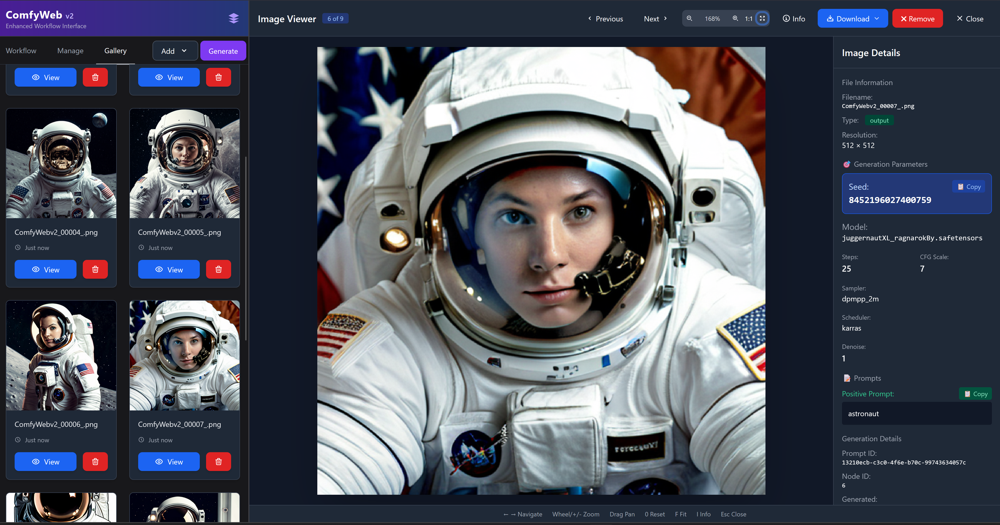
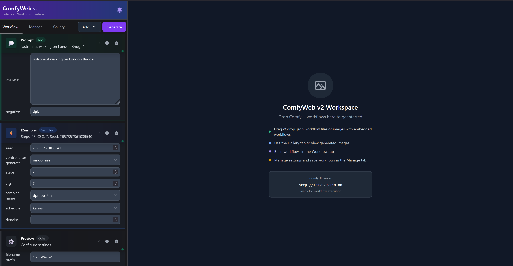
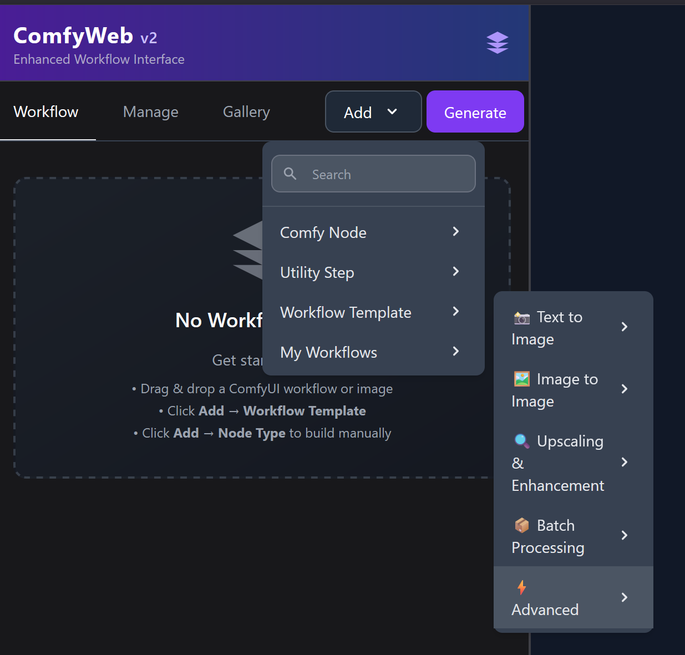
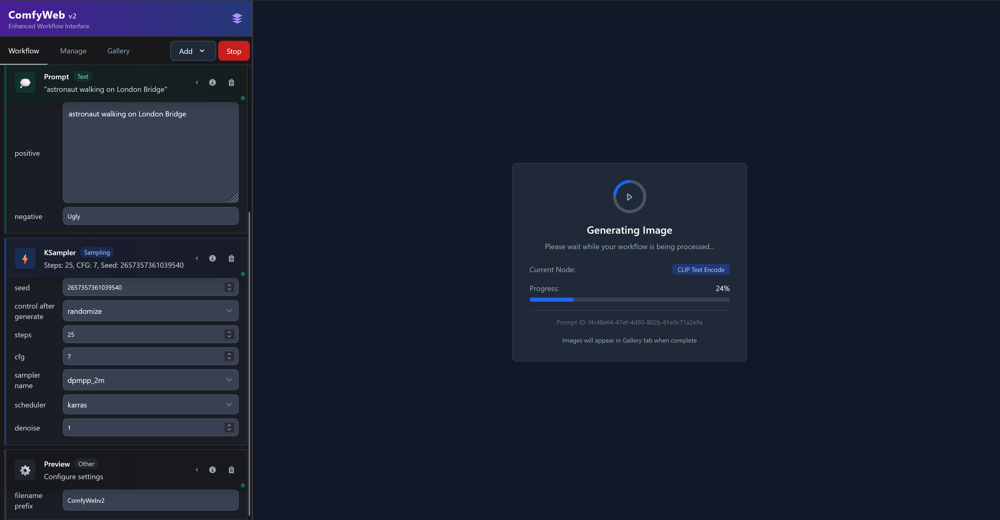

# ComfyWeb v2 - Enhanced Workflow Interface

**A form-based approach to ComfyUI workflows with persistent storage and comprehensive image inspection tools**

   

---

## 💾 **Persistent Workflow Storage**

### **Enterprise-Grade Data Persistence**
ComfyWeb v2 features **persistent AppData storage** that keeps your workflows safe across browser sessions:

- **🗂️ Filesystem Storage** - Workflows saved to your system's AppData directory
- **🔄 Cross-Session Persistence** - Data survives browser restarts, clears, and incognito mode
- **🌐 Cross-Platform Support** - Automatic path resolution for Windows, Mac, and Linux
- **🛡️ Dual Storage System** - AppData primary with localStorage fallback for reliability
- **📦 Automatic Migration** - Seamlessly migrates existing browser-stored workflows

### **Storage Locations:**
- **Windows**: `%APPDATA%\ComfyWebV2\workflows\`
- **Mac**: `~/Library/Application Support/ComfyWebV2/workflows/`
- **Linux**: `~/.config/ComfyWebV2/workflows/`

---

## 🔍 **Image Viewer with Metadata Access**


*Complete metadata access with seed copying, parameter viewing, and zoom controls*

### **Image Inspection Features**
- **💾 Seed Copying** - Copy seeds and parameters for reproducible results
- **📋 Parameter Access** - View all generation settings with scrollable metadata
- **🔍 Zoom & Pan** - Mouse wheel zoom with smooth pan controls  
- **📁 Export Options** - Download original, with metadata, or as JSON
- **⌨️ Keyboard Shortcuts** - Navigate efficiently with keyboard controls
- **🖼️ Gallery Navigation** - Browse through generated images with thumbnails

---

## 🌟 What is ComfyWeb v2?

ComfyWeb v2 transforms ComfyUI's node-graph system into a form-based workflow interface. Instead of connecting nodes, users work with simple forms and templates to create AI images.


*Node-graphs become configurable cards executed sequentially*

ComfyWeb v2 builds upon the original [ComfyWeb](https://github.com/jac3km4/comfyweb) by [@jac3km4](https://github.com/jac3km4), adding enhanced features and tools for AI image generation workflows.

---

## 📚 **Template Library**


*14 templates organized across 5 categories*

### **Available Templates:**
- **📸 Text to Image** (3) - SDXL Basic, SD 1.5 Classic, Flux GGUF
- **🖼️ Image to Image** (3) - Basic, SDXL, and SD 1.5 variants  
- **🔍 Upscaling & Enhancement** (2) - Quality improvement workflows
- **📦 Batch Processing** (1) - Multiple generation workflows
- **⚡ Advanced** (5) - LoRA, ControlNet, Inpainting, Professional Portrait

Each template includes optimized settings, time estimates, and difficulty indicators.

---

## ⚡ **Generation Monitoring**


*Real-time generation tracking with progress monitoring*

### **Generation Features:**
- **📊 Progress Tracking** - View completion percentage and current processing node
- **⏹️ Stop Control** - Interrupt generation with dedicated stop button  
- **📡 Status Updates** - Real-time feedback throughout the generation process
- **🖼️ Automatic Gallery** - Generated images appear in session-persistent gallery
- **💾 Session Recovery** - Work continues after browser refresh

---

## 🛠️ **Workflow Management**


*Comprehensive workflow management with persistent storage*

### **Management Features:**
- **💾 Save Workflows** - Store custom configurations permanently to filesystem
- **📥 Import/Export** - Work with ComfyUI JSON files
- **🔄 Workflow Organization** - Professional workflow management with metadata
- **🧹 Workspace Control** - Clear workspace to start fresh
- **⚙️ Settings** - Configure ComfyUI server connection
- **🗂️ Persistent Storage** - Workflows saved to AppData directory, never lost

---

## 🆕 **Enhanced Features in v2**

### **Persistent Storage System**
- AppData filesystem storage for permanent workflow preservation
- Cross-platform compatibility with automatic path detection
- Dual storage system (AppData + localStorage) for maximum reliability
- Automatic migration from browser storage to filesystem
- Professional data management with indexing and metadata

### **Image Inspection Tools**
- Complete metadata viewing with parameter access
- One-click seed and parameter copying
- Professional zoom and pan controls
- Multiple export formats (original, with metadata, JSON)

### **Template System**  
- 14 pre-configured templates across multiple categories
- Progressive difficulty levels from beginner to advanced
- Optimized settings for specific use cases
- Clear categorization with visual navigation

### **Workflow Interface**
- Card-based representation of node workflows
- Form-based parameter adjustment
- Visual workflow structure display
- Error prevention through interface design

### **Advanced Management**
- Professional workflow storage with filesystem persistence
- Session state recovery after refresh
- Drag-and-drop ComfyUI workflow import
- Missing node detection with guidance

### **Image Handling**
- Drag-and-drop upload with instant previews
- Professional loading states and feedback
- Gallery system with thumbnail navigation
- Support for PNG, JPG, WebP formats

---

## 📖 **Documentation**

For complete usage instructions and tutorials:

### 📚 **[ComfyWeb V2 User Manual](ComfyWebV2_User_Manual.md)**

The user manual includes:
- **Template and workflow system overview**
- **Complete feature documentation with examples**
- **Step-by-step usage tutorials**
- **Image viewer and gallery system guides**
- **Workflow import and management instructions**
- **Persistent storage and migration guides**
- **Troubleshooting and common solutions**

---

## 🎯 **Use Cases**

### **Suitable For:**
- Linear workflows with clear step progression
- Template-based generation using pre-configured setups
- Users new to ComfyUI who prefer form-based interfaces
- Quick iteration on prompts and basic parameters
- Standard workflows (SDXL, ControlNet, LoRA integration)
- Image inspection with metadata analysis
- Professional workflow management requiring data persistence

### **Consider ComfyUI Direct For:**
- Complex conditional workflows with branching logic
- Advanced node graphs requiring specialized connections
- Custom workflow architectures with unique requirements
- Production automation with complex scripting
- Workflows using advanced ComfyUI-specific features

---

## 🚀 **Quick Start**

### **Prerequisites**

Both ComfyUI and Node.js are required:

#### **ComfyUI Installation**
```bash
git clone https://github.com/comfyanonymous/ComfyUI.git
cd ComfyUI
python -m venv venv
source venv/bin/activate  # Linux/Mac
# venv\\Scripts\\activate   # Windows
pip install torch torchvision torchaudio --index-url https://download.pytorch.org/whl/cu121
pip install -r requirements.txt
```

#### **Node.js Installation**
Download and install [Node.js](https://nodejs.org/) (v16 or higher)

### **Installation**

```bash
git clone https://github.com/virtaava/comfywebv2.git
cd comfywebv2
npm install
npm run dev
```

### **Running the Application**

Start ComfyUI:
```bash
cd /path/to/ComfyUI
source venv/bin/activate
python main.py --enable-cors-header '*'
```

Start ComfyWeb v2:
```bash
cd /path/to/comfywebv2
npm run dev
```

Access the interface at http://localhost:5173

### **First Run - AppData Storage Setup**

ComfyWeb v2 automatically:
1. **Creates AppData directories** in your system's standard location
2. **Migrates existing workflows** from browser storage to filesystem
3. **Sets up persistent storage** for all future workflows
4. **Provides fallback** to browser storage if AppData is unavailable

No manual configuration required - storage is automatically managed!

---

## 📖 **Basic Usage**

### **Standard Workflow:**
1. **Select Template** - Choose from organized template categories
2. **Configure Parameters** - Adjust settings using form fields
3. **Upload Images** - Drag images for image-to-image workflows
4. **Generate** - Start generation with real-time monitoring
5. **Inspect Results** - Use image viewer for detailed analysis
6. **Save Configuration** - Store workflows permanently to filesystem

### **Additional Features:**
- **Import Workflows** - Load ComfyUI JSON files
- **Session Recovery** - Continue work after browser refresh
- **Gallery Management** - Organize and browse generated images
- **Progress Control** - Monitor and stop generation as needed
- **Persistent Storage** - All workflows automatically saved to AppData

---

## 🛠️ **Technical Details**

### **Technology Stack**
- **Framework**: Svelte 4.2.18 with TypeScript 5.5.3
- **Build Tool**: Vite 5.4.1 with single-file output
- **Styling**: Tailwind CSS 3.4.9 + Flowbite components
- **Integration**: ComfyUI HTTP API + WebSocket connectivity
- **Storage**: AppData filesystem storage with localStorage fallback

### **Architecture**
- Form-based UI layer over ComfyUI's node system
- Workflow-to-form transformation engine
- Template library with predefined configurations
- Persistent AppData storage system with cross-platform support
- Dual storage architecture for maximum reliability
- Image inspection with metadata extraction

### **Storage Architecture**
- **Primary Storage**: AppData filesystem directories
- **Fallback Storage**: Browser localStorage for compatibility
- **Migration System**: Automatic transition from browser to filesystem
- **Data Format**: JSON workflow files with metadata indexing
- **Cross-Platform**: Automatic path detection for Windows/Mac/Linux

---

## 🔧 **Development**

### **Building**
```bash
npm run build
```

### **Development Server**
```bash
npm run dev
```

### **Contributing**
1. Fork the repository
2. Create a feature branch
3. Test changes with real ComfyUI workflows
4. Ensure AppData storage compatibility
5. Submit a pull request with clear descriptions

---

## 📝 **Version History**

### **v2.0.0 - Current Release**
- **🆕 Persistent AppData Storage** - Filesystem storage with cross-platform support
- **🆕 Dual Storage System** - AppData primary with localStorage fallback
- **🆕 Automatic Migration** - Seamless transition from browser storage
- Enhanced image viewer with metadata access and zoom controls
- Generation control with stop functionality and real-time monitoring
- Local workflow storage and management
- Enhanced gallery with session persistence
- Professional image upload with visual previews
- Missing node detection with installation guidance
- Expanded template library with 14 templates across 5 categories
- Improved error handling and stability
- Complete TypeScript implementation

---

## 🙏 **Credits**

### **Original Framework**
**[@jac3km4](https://github.com/jac3km4)** - Creator of the original [ComfyWeb](https://github.com/jac3km4/comfyweb)

### **ComfyUI Integration**
**[@comfyanonymous](https://github.com/comfyanonymous)** - [ComfyUI](https://github.com/comfyanonymous/ComfyUI) platform

### **v2 Development**
**[@virtaava](https://github.com/virtaava)** - Enhanced features and persistent storage system

---

## 📄 **License**

MIT License - see [LICENSE](LICENSE) file for details.

---

## 🔗 **Resources**

- **📚 [User Manual](ComfyWebV2_User_Manual.md)** - Complete usage guide
- **Original ComfyWeb**: https://github.com/jac3km4/comfyweb  
- **ComfyUI**: https://github.com/comfyanonymous/ComfyUI
- **Support**: GitHub Issues

---

*A focused approach to AI image generation workflows with ComfyUI and enterprise-grade data persistence.*